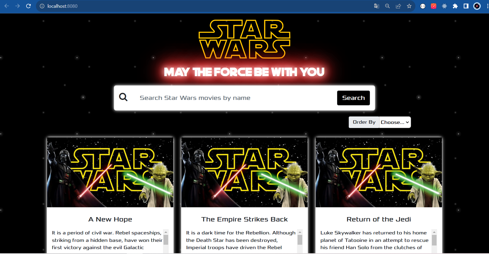
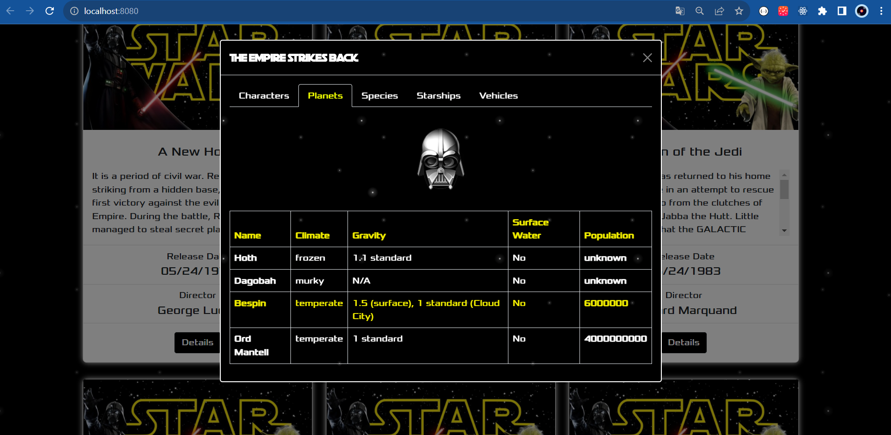

# Star Wars Lisit

## Descripción

Star Wars Lisit es una increíble aplicación que te sumergirá en el emocionante universo de Star Wars. Conectándose a la API de StarWars, esta aplicación te permitirá explorar todos los episodios de la saga, desde las icónicas películas originales hasta las más recientes entregas.

Descubre detalles fascinantes sobre cada película, como el nombre, el año de lanzamiento, el director y una breve sinopsis. Además, podrás adentrarte en la historia de cada película, accediendo a información privilegiada sobre los personajes, los planetas, las especies y las naves espaciales presentadas en cada episodio.

La interfaz amigable y la presentación visual atractiva hacen que navegar por la galaxia de Star Wars sea una experiencia emocionante. ¿Eres un fanático de la saga o simplemente quieres conocer más sobre el mundo de Star Wars? ¡Esta es la aplicación que estabas buscando!

## Capturas de pantalla

## Cómo ejecutar el proyecto

Para poder disfrutar de Star Wars Lisit, sigue estos pasos para ejecutar el proyecto localmente:

1. Descarga o clona este repositorio en tu máquina local.

2. Abre la terminal y navega hasta la carpeta principal del proyecto.

3. Ejecuta el comando `npm install` para instalar todas las dependencias del proyecto.

4. Después de completar la instalación, ejecuta el comando `npm run serve` para iniciar el servidor local.

5. Abre tu navegador web y accede a la dirección http://localhost:8080 para ver la aplicación en acción.

¡Sumérgete en el emocionante universo de Star Wars y explora todas las películas de la franquicia! ¿Qué esperas? ¡Que la Fuerza te acompañe en esta emocionante aventura!
